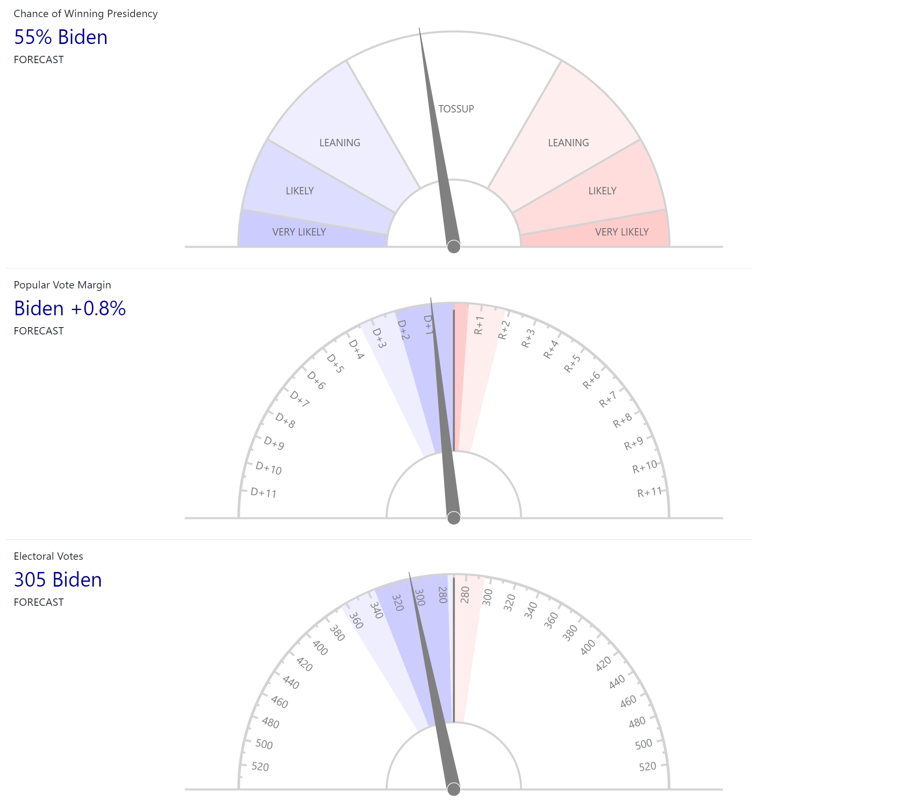

# pointer

Displays US election meters similar (pure coincidence i assure you) to others you may have seen.
But I'm not a ~~rapper~~ frontend developer.

## Compile with
`./mvnw clean package`

## Run with
`java -jar target/pointer-0.0.1-SNAPSHOT.jar` (uses Java 8 or later)

## View meters
On http://localhost:8080

## Update meters
Confuse and infuriate any friends you may have by POSTing new values to the /update endpoint:

`curl -X POST "localhost:8080/update?chance=10&margin=-11&votes=-290&isForecast=false"`

`chance` param is from 0 to 100 and is the chance of trumo winning. 0 is a Biden certainty, 100 is a certain win for the other guy. 

`margin` param is from -12 (12 pt swing to D) to +12 (12 pt swing to R)

`votes` is from 270 to 540 (if you mean Trump) or in the range -540 to -270 (if you mean Biden)

`isForecast` is true or false, not required and will default to true if not present

Connected meters will be updated via the magic of websockets.

It looks like this

